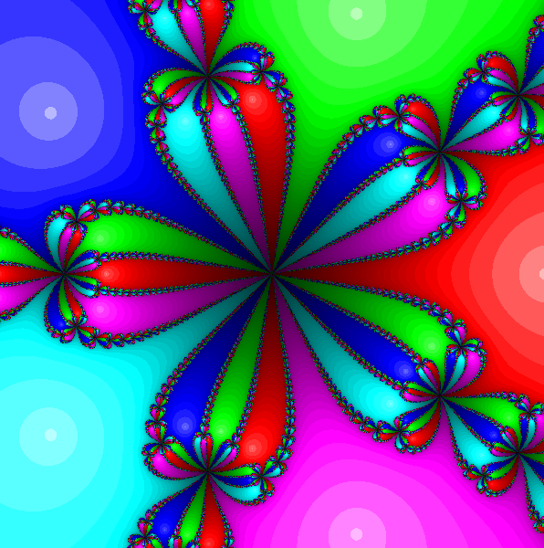

# NewtonFractal

**NewtonFractal** is a *Qt5-Application* that renders fractals based on **Newton's method**.

- Move up to *6* roots with drag & drop
- Move fractal
- Zoom in and out
- Export fractal as *png*
- Multi- or singlethreading
- Change maximum number of newton iterations, ...



## Getting Started

Get started by either downloading the current release (for *Windows*) or by building it with `qmake` and `make` (for *Windows*, *Linux* and *Mac*).

### Prerequisites

To build this application, you will need Qt5. If you are going to build on Windows, you need to make sure, that your `PATH` variable contains paths to *Qt* and *MinGW* / *MSVC* toolsets (*bin* folder).

### Building

Clone the GitHub repository
```bash
git clone https://github.com/chrizbee/NewtonFractal NewtonFractal
cd NewtonFractal
```

Build it using `qmake` and `make`
```bash
qmake
make [release | debug]
```
*Note*: The `release` build will be much faster than `debug`.

Run the application
```bash
cd build
./NewtonFractal
```

## Deployment

- **Linux** - [linuxdeployqt](https://github.com/probonopd/linuxdeployqt)
- **Windows** - [windeployqt](https://doc.qt.io/qt-5/windows-deployment.html)

## Built With

* [Qt5](https://www.qt.io/) - The UI framework used

## Versioning

We use [SemVer](http://semver.org/) for versioning. The current version is stored in [NewtonFractal.pro](NewtonFractal.pro) (`VERSION`).

## Authors

- **Christian Bauer** - [chrizbee](https://github.com/chrizbee)
- **Timon Föhl** - [opit7](https://github.com/opit7)

See also the list of [contributors](https://github.com/chrizbee/NewtonFractal/contributors) who participated in this project.

## License

This project is licensed under the GNU General Public License v3 - see the [LICENSE](LICENSE) file for details.

## Acknowledgments & Sources

- Inspired by [ActiveState](http://code.activestate.com/recipes/577166-newton-fractals/)
- Icons by [Icons8](https://icons8.com/)
